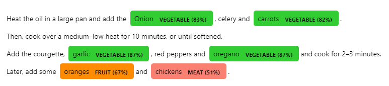

# Concise Concepts
When wanting to apply NER to concise concepts, it is really easy to come up with examples, but pretty difficult to train an entire pipeline. Concise Concepts uses few-shot NER based on word embedding similarity to get you going with easy!

# Install

```
pip install concise-concepts
```

# Quickstart

```python
import spacy
from spacy import displacy
import concise_concepts

data = {
    "fruit": ["apple", "pear", "orange"],
    "vegetable": ["broccoli", "spinach", "tomato"],
    "meat": ["beef", "pork", "fish", "lamb"]
}

text = """
    Heat the oil in a large pan and add the Onion, celery and carrots. 
    Then, cook over a medium–low heat for 10 minutes, or until softened. 
    Add the courgette, garlic, red peppers and oregano and cook for 2–3 minutes.
    Later, add some oranges and chickens. """

nlp = spacy.load("en_core_web_lg")
nlp.add_pipe("concise_concepts", config={"data": data})
doc = nlp(text)


options = {"colors": {"fruit": "darkorange", "vegetable": "limegreen", "meat": "salmon"},
           "ents": ["fruit", "vegetable", "meat"]}

displacy.render(doc, style="ent", options=options)
```

## use specific number of words to expand over

```python
data = {
    "fruit": ["apple", "pear", "orange"],
    "vegetable": ["broccoli", "spinach", "tomato"],
    "meat": ["beef", "pork", "fish", "lamb"]
}

topn = [50, 50, 150]

assert len(topn) == len

nlp.add_pipe("concise_concepts", config={"data": data, "topn": topn})
````

## use gensim.word2vec model from pre-trained gensim or custom model path

```python
data = {
    "fruit": ["apple", "pear", "orange"],
    "vegetable": ["broccoli", "spinach", "tomato"],
    "meat": ["beef", "pork", "fish", "lamb"]
}

# model from https://radimrehurek.com/gensim/downloader.html or path to local file
model_path = "glove-twitter-25"

nlp.add_pipe("concise_concepts", config={"data": data, "model_path": model_path})
````


